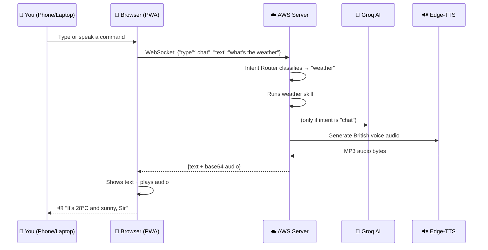
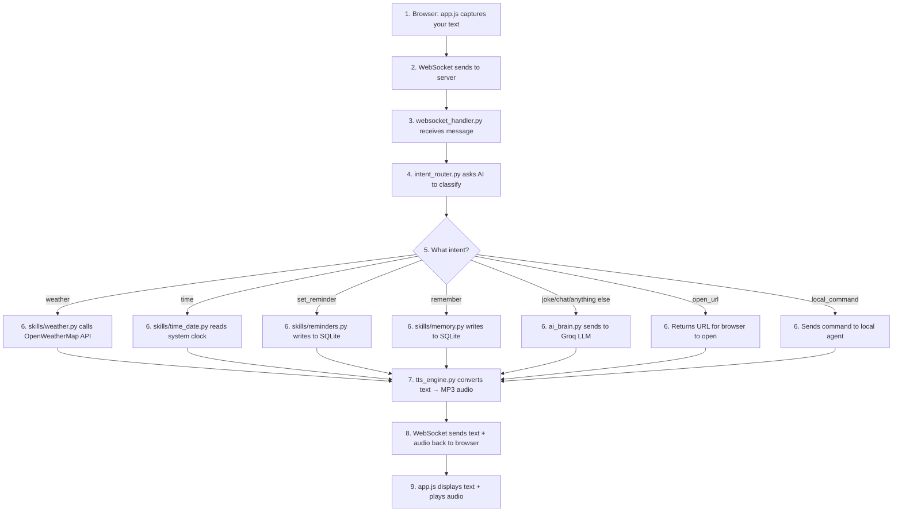

# J.A.R.V.I.S. — Complete Guide: How It Works + AWS Deployment

---

# Part 1: How the Entire System Works

## The Big Picture (30 Seconds)



---

## Every File Explained

### 🗂️ Project Structure

```
Jarvis/
│
├── main.py                  ← 🚪 ENTRY POINT (start here)
├── config.py                ← ⚙️ All settings from .env
├── .env                     ← 🔑 Your API keys & passwords
│
├── core/                    ← 🧠 THE BRAIN
│   ├── ai_brain.py          ← AI chat (Groq/Gemini/OpenAI)
│   ├── tts_engine.py        ← Text → British voice audio
│   └── intent_router.py     ← Understands what you want
│
├── skills/                  ← 💪 WHAT JARVIS CAN DO
│   ├── weather.py           ← Weather from OpenWeatherMap
│   ├── news.py              ← BBC headlines
│   ├── reminders.py         ← Set/list reminders (saved to DB)
│   ├── memory.py            ← "Remember that..." (saved to DB)
│   └── time_date.py         ← Time, date, greetings
│
├── api/                     ← 🔌 HOW CLIENTS CONNECT
│   ├── auth.py              ← Login → JWT token
│   ├── routes.py            ← REST API (/api/briefing, etc.)
│   └── websocket_handler.py ← Real-time voice pipeline
│
├── static/                  ← 🎨 THE UI (what you see in browser)
│   ├── index.html           ← Page structure
│   ├── css/style.css        ← Iron Man HUD look
│   ├── js/app.js            ← All frontend logic
│   ├── manifest.json        ← PWA config (iPhone home screen)
│   └── sw.js                ← Offline caching
│
├── agent/                   ← 💻 LAPTOP PC CONTROL
│   ├── local_agent.py       ← Opens apps, locks PC, etc.
│   └── .env                 ← Agent's server URL + token
│
├── data/                    ← 💾 DATABASE (auto-created)
│   └── jarvis.db            ← SQLite: reminders + memories
│
├── Dockerfile               ← 📦 Container recipe
├── docker-compose.yml       ← 🚀 One-command deploy
└── requirements.txt         ← 📋 Python packages needed
```

---

## How Data Flows (Step by Step)

### When you type "what's the weather" in the browser:



---

## Where to Change Things

### 🔧 "I want to add a new skill"

**Example: Add a calculator skill**

**Step 1:** Create [skills/calculator.py](file:///c:/Users/yoash/Desktop/music/Jarvis/skills/calculator.py)
```python
def calculate(expression: str) -> str:
    try:
        result = eval(expression)  # be careful with eval in production!
        return f"The answer is {result}, Sir."
    except:
        return "I couldn't calculate that, Sir."
```

**Step 2:** Add the intent to [core/intent_router.py](file:///c:/Users/yoash/Desktop/music/Jarvis/core/intent_router.py) — add `"calculate"` to the `INTENT_SCHEMA` string:
```
- "calculate" — user wants to do math. params: {"expression": "..."}
```

**Step 3:** Handle it in [api/websocket_handler.py](file:///c:/Users/yoash/Desktop/music/Jarvis/api/websocket_handler.py) — add an `elif` in `_handle_chat()`:
```python
elif intent == "calculate":
    from skills.calculator import calculate
    response_text = calculate(params.get("expression", text))
```

That's the pattern for ALL new skills: **create skill file → add intent → handle in websocket_handler**.

---

### 🎨 "I want to change the UI look"

Edit [static/css/style.css](file:///c:/Users/yoash/Desktop/music/Jarvis/static/css/style.css):

| Want to change... | Look for... |
|---|---|
| Main colors | `:root` variables at the top (`--accent`, `--bg-primary`) |
| Orb size | `.jarvis-orb` → `width`/`height` |
| Orb glow color | `.orb-core` → `background` gradient |
| Chat bubble style | `.chat-msg.jarvis` and `.chat-msg.user` |
| Font | `--font-display`, `--font-body` variables |
| Animations speed | `@keyframes` at the bottom |

---

### 🗣️ "I want to change Jarvis's voice"

Edit [config.py](file:///c:/Users/yoash/Desktop/music/Jarvis/config.py) → `TTS_VOICE`:

| Voice | Code |
|---|---|
| British male (current) | `en-GB-RyanNeural` |
| Deeper British male | `en-GB-ThomasNeural` |
| American male | `en-US-GuyNeural` |
| Indian English male | `en-IN-PrabhatNeural` |
| British female | `en-GB-SoniaNeural` |

---

### 🧠 "I want to use a different AI model"

Edit [.env](file:///c:/Users/yoash/Desktop/music/Jarvis/.env):

```bash
# Use Gemini instead of Groq
AI_PROVIDER=gemini
GEMINI_API_KEY=your_key_here

# Or use OpenAI
AI_PROVIDER=openai
OPENAI_API_KEY=your_key_here
OPENAI_MODEL=gpt-4o
```

---

### ➕ "I want to add a quick action button"

**Step 1:** Add the button HTML in [static/index.html](file:///c:/Users/yoash/Desktop/music/Jarvis/static/index.html) inside `.quick-actions`:
```html
<button class="action-btn" data-skill="jokes" title="Joke">
    <svg viewBox="0 0 24 24" fill="none" stroke="currentColor" stroke-width="2">
        <circle cx="12" cy="12" r="10"/>
        <path d="M8 14s1.5 2 4 2 4-2 4-2"/>
        <line x1="9" y1="9" x2="9.01" y2="9"/>
        <line x1="15" y1="9" x2="15.01" y2="9"/>
    </svg>
    <span>Joke</span>
</button>
```

**Step 2:** Handle it in [api/websocket_handler.py](file:///c:/Users/yoash/Desktop/music/Jarvis/api/websocket_handler.py) → `_handle_action()`:
```python
elif skill == "jokes":
    text = brain.chat("Tell me a short clever joke.")
```

The JS in `app.js` already handles all `data-skill` buttons automatically — no JS changes needed!

---

---

# Part 2: AWS Deployment (Every Step)

## Prerequisites

- ✅ AWS account (you have this)
- ✅ Your project files (you have these)
- A GitHub repo to push your code (recommended)

---

## Step 1: Push Code to GitHub

Open a terminal in your project folder:

```powershell
cd C:\Users\yoash\Desktop\music\Jarvis

git init
git add .
git commit -m "Jarvis v3.0 - cloud native"
```

Then create a repo on [github.com/new](https://github.com/new) and push:

```powershell
git remote add origin https://github.com/YOUR_USERNAME/jarvis.git
git branch -M main
git push -u origin main
```

> [!CAUTION]
> Make sure `.env` is in your `.gitignore` (it already is). Your API keys should NEVER be on GitHub.

---

## Step 2: Launch EC2 Instance

1. Go to **[AWS Console → EC2](https://console.aws.amazon.com/ec2)**
2. Click **"Launch Instance"**
3. Configure:

| Setting | Value |
|---|---|
| **Name** | `jarvis-server` |
| **AMI** | Ubuntu Server 22.04 LTS (Free tier eligible) |
| **Instance type** | `t3.micro` (Free tier — 1 vCPU, 1 GB RAM) |
| **Key pair** | Create new → name it `jarvis-key` → Download the `.pem` file |
| **Security group** | Create new with these rules ⬇️ |

**Security group rules:**

| Type | Port | Source | Why |
|---|---|---|---|
| SSH | 22 | My IP | So you can connect |
| Custom TCP | 8000 | 0.0.0.0/0 | Jarvis web app |
| HTTPS | 443 | 0.0.0.0/0 | For iPhone mic access later |

4. Click **"Launch Instance"**
5. Wait ~1 minute for it to start
6. Go to the instance details → copy the **Public IPv4 address**

---

## Step 3: Connect to Your Server

Open PowerShell on your laptop:

```powershell
# Move the key to a safe place
Move-Item ~/Downloads/jarvis-key.pem ~/.ssh/jarvis-key.pem

# Connect (replace YOUR_IP with the EC2 public IP)
ssh -i ~/.ssh/jarvis-key.pem ubuntu@YOUR_IP
```

> [!TIP]
> If you get a permissions error on the `.pem` file, run:
> ```powershell
> icacls $HOME\.ssh\jarvis-key.pem /inheritance:r /grant:r "$($env:USERNAME):(R)"
> ```

---

## Step 4: Install Docker on EC2

Once you're SSH'd into the server, run these commands:

```bash
# Install Docker
curl -fsSL https://get.docker.com | sh

# Let ubuntu user run docker without sudo
sudo usermod -aG docker ubuntu

# Log out and back in for group change to take effect
exit
```

SSH back in:
```powershell
ssh -i ~/.ssh/jarvis-key.pem ubuntu@YOUR_IP
```

Verify Docker works:
```bash
docker --version
# Should show: Docker version 2x.x.x
```

---

## Step 5: Deploy Jarvis

```bash
# Clone your repo
git clone https://github.com/YOUR_USERNAME/jarvis.git
cd jarvis

# Create your .env file
cp .env.example .env
nano .env
```

In nano, fill in your actual values:
```
AI_PROVIDER=groq
GROQ_API_KEY=gsk_paste_your_actual_groq_key_here
GROQ_MODEL=llama-3.3-70b-versatile
JARVIS_PASSWORD=your_strong_password_here
JWT_SECRET=some_random_long_string_here
OPENWEATHER_API_KEY=your_key_here
WEATHER_CITY=Delhi
```

Press `Ctrl+O` to save, `Ctrl+X` to exit nano.

```bash
# Build and start Jarvis
docker compose up -d

# Check it's running
docker compose logs -f
# You should see: "Uvicorn running on http://0.0.0.0:8000"
# Press Ctrl+C to stop watching logs (server keeps running)
```

---

## Step 6: Access Jarvis

### From your laptop:
Open browser → `http://YOUR_IP:8000`

### From your iPhone:
Open Safari → `http://YOUR_IP:8000`

> [!WARNING]
> **Voice input won't work on iPhone yet** — Safari requires HTTPS for microphone access. Text input works fine. See Step 7 for the fix.

---

## Step 7: Enable HTTPS (Required for iPhone Mic)

The easiest free method — **Cloudflare Tunnel** (no domain needed):

```bash
# On your EC2 server:

# Download cloudflared
curl -L https://github.com/cloudflare/cloudflared/releases/latest/download/cloudflared-linux-amd64 -o cloudflared
chmod +x cloudflared

# Start the tunnel (gives you a free HTTPS URL)
./cloudflared tunnel --url http://localhost:8000
```

It will print something like:
```
Your quick tunnel has been created!
https://random-words-here.trycloudflare.com
```

**That URL works with HTTPS** — open it on iPhone Safari, and the microphone will work!

To keep it running in the background:
```bash
nohup ./cloudflared tunnel --url http://localhost:8000 &
```

### Add to iPhone Home Screen:
1. Open the `https://....trycloudflare.com` URL in iPhone Safari
2. Tap the **Share button** (square with arrow)
3. Tap **"Add to Home Screen"**
4. Name it "JARVIS" → tap Add
5. Now it's an app icon on your home screen! 🎉

---

## Step 8: Setup Local Agent (PC Control)

On your **laptop** (not the server):

```powershell
cd C:\Users\yoash\Desktop\music\Jarvis\agent
pip install -r requirements.txt
```

Edit `agent/.env`:
```
JARVIS_SERVER=ws://YOUR_IP:8000/ws
JARVIS_TOKEN=paste_your_jwt_token_here
```

**How to get your JWT token:**
1. Open Jarvis in browser → login
2. Press `F12` → Console tab
3. Type: `localStorage.getItem('jarvis_token')`
4. Copy the token string

Start the agent:
```powershell
python local_agent.py
```

Now when you say "open notepad" or "lock my PC" from your phone, the command goes:
```
iPhone → AWS server → your laptop agent → opens the app
```

---

## Useful AWS Commands

```bash
# SSH into server
ssh -i ~/.ssh/jarvis-key.pem ubuntu@YOUR_IP

# View Jarvis logs
docker compose logs -f

# Restart Jarvis after code changes
docker compose down
git pull
docker compose up -d --build

# Stop Jarvis
docker compose down

# Check if container is running
docker ps
```

---

## Cost Summary

| Resource | Cost |
|---|---|
| EC2 t3.micro | **Free** (12 months free tier) |
| Groq API | **Free** (14,400 req/day) |
| Edge-TTS | **Free** (Microsoft, no limits) |
| Cloudflare Tunnel | **Free** |
| OpenWeatherMap | **Free** (1,000 calls/day) |
| **Total** | **$0/month** for 12 months |

After free tier: ~$8/month for EC2, or $3.50/month on Lightsail.

---

## Quick Reference

| Task | Command / Location |
|---|---|
| Start server locally | `python main.py` |
| Start on AWS | `docker compose up -d` |
| Stop on AWS | `docker compose down` |
| View logs | `docker compose logs -f` |
| Change password | `.env` → `JARVIS_PASSWORD` |
| Change AI provider | `.env` → `AI_PROVIDER` |
| Change voice | `config.py` → `TTS_VOICE` |
| Add a skill | `skills/` → new file, update `intent_router.py` + `websocket_handler.py` |
| Change UI colors | `static/css/style.css` → `:root` variables |
| Add quick action | `static/index.html` → `.quick-actions` div |
| Database location | `data/jarvis.db` |
